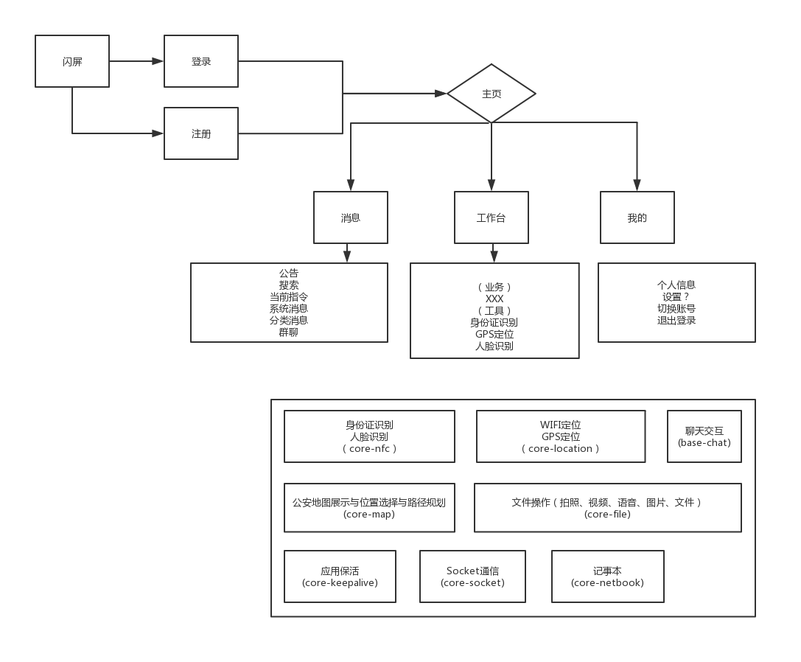

## 项目介绍

### 前言
本项目源于 [ABCL](https://github.com/hslooooooool/abcl)精简优化后得到
为避免过度设计、设计缺陷等问题，暂定框架的开发边界仅为安卓核心功能，如需要常用工具、自定义控件请自行拓展。

为减少上传文件大小,已清除整个项目,因时间关系未配置混淆和完全清除无用资源,为方便您的查看,作业相关代码已整理.

### ABCL结构：

### 技术特征

- Jetpack(AndroidX)
- Lifecycles/LiveData/ViewModel/Room
- Android KTX/Kotlin
- RxJava/RxAndroid
- Retrofit2/OKHttp3 可以换成4了
- Material Design
- Glide
- ARouter 等等

### 使用成本/开发环境要求

- Android Studio 3.4+
- Gradle 5.1.1+
- Kotlin 1.3.31+
- CompileSdkVersion 28+

### 开发约定

- lib层仅维护实体对象，资源、路由、静态类、通用方法、基础类、配置
- 独有功能在base和core间增加并在base-core中依赖
- 开发满足[开发规范](https://github.com/hslooooooool/dev-doc/)

### 各功能依赖

- 【进行中】APP[app]

- 【已完成】独立业务-发现及朋友圈 [base-find] 本次作业重点
- 【已完成】核心功能依赖[base-core] 本次作业需要

- 【已移除】核心功能-消息通信 [core-socket]
- 【已移除】核心功能-记事本 [core-netbook]
- 【已移除】核心功能-地图展示、位置选择、导航 [core-map]
- 【已移除】核心功能-GPS定位 [core-location]
- 【已移除】核心功能-应用保活 [core-keepalive]
- 【已移除】核心功能-身份识别、人脸识别 [core-nfc]
- 【已移除】核心功能-二维码 [core-qrcode]
- 【已移除】核心功能-动态表单 [core-form]
- 【已移除】核心功能-拍照、图库选择、文件选择、视频录制、音频录制 [core-file]

- 【已完成】核心功能-视频播放、图片画廊 [core-play] 本次作业需要
    - 【已完成】图片预览（放大缩小，上下切换）
- 【已完成】基础功能依赖[core-lib] 本次作业需要

- 【已完成】基础功能-网络请求 [lib-netservice] 本次作业需要
- 【已完成】基础功能-基础框架（基础配置、路由管理、数据库管理、常量管理、工具类） [lib-base] 本次作业需要 

## keytool -list -v -keystore ..\doc\release.jks